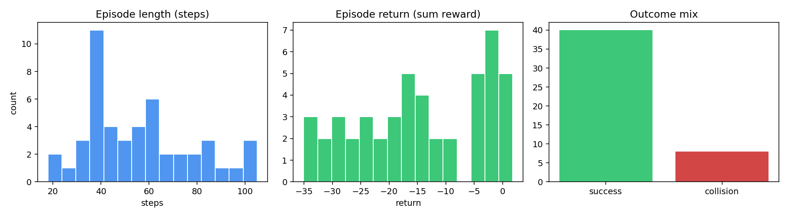
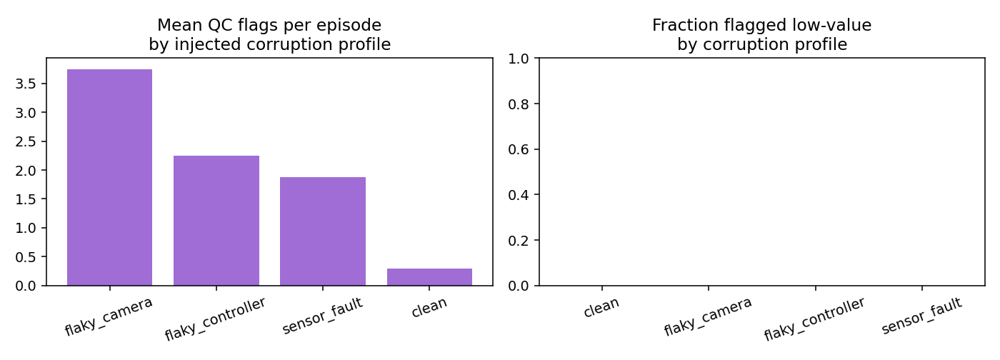
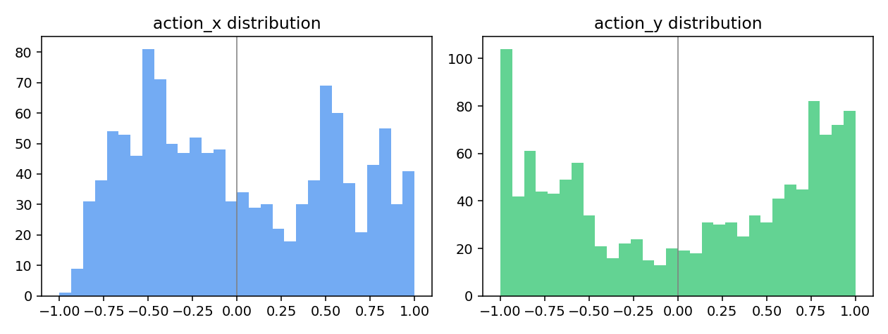

# TrajLens — Data Quality & Analysis Report

- Episodes collected: **48**

- Episodes retained in exported dataset: **21** (44%)

- Overall pilot success rate: **83%**

- Mean automated QC flags per episode: **1.46**

- Simulated inter-annotator agreement (Cohen's κ, keep/discard): **0.45**

- Episodes excluded and why: **27** (see `exclusions.json` for the full audit list)

## Figures

## Reading the numbers

Episodes generated under an injected `flaky_camera` or `flaky_controller` corruption profile should show visibly higher mean QC-flag counts than `clean` episodes in the chart above — that comparison is the closest thing this project has to a unit test for the QC layer itself: if flagged episodes and injected-corruption episodes did not line up, the checks would be unreliable regardless of how they read in isolation.
